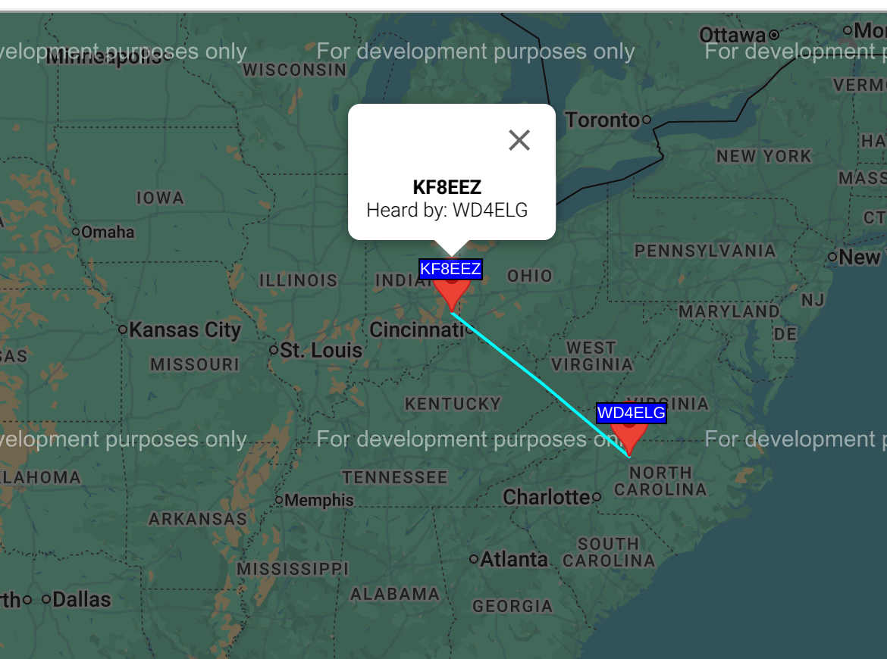

## Not for launch

One of the resistors that are designed to bleed off charge from the antenna came off. The unit can be used for ground testing, but won't be used for flight.

## U4B 001

Notes for u4b number 001 


 +---Configuration------------------------+
 |                                        |
 |   Callsign            KF8EEZ           |
 |   Band                20m              |
 |   Channel             567              |
 |   Autostart program   TRACKER          |
 |                                        |
 |   Frequency           14097060         |
 |   Telemetry format    QX8XXX XXXX XX   |
 |   Start minute        02               |
 |                                        |
 |     Use left & right arrow keys to     |
 |        change Band and Channel.        |
 |                                        |
 +------------------------Ctrl-Q = Quit---+

upgraded firmware, 2026-04-05


     U4B 1_01_001
     QRP Labs, 2025
                             +---Configuration------------------------+
                             |                                        |
     Configuration           |   Callsign            KF8EEZ           |
     Run program             |   Band                20m              |
     Text editor             |   Channel             567              |
     File manager            |   Autostart program   TRACKER2         |
     Command line            |                                        |
     Hardware test           |   Frequency           14097060         |
     Factory reset           |   Telemetry format    QX8XXX XXXX XX   |
     Update F/W              |   Start minute        02               |
                             |                                        |
                             |     Use left & right arrow keys to     |
                             |        change Band and Channel.        |
                             |                                        |
                             +------------------------Ctrl-Q = Quit---+


original firmware:


     U4B 1_00_003
     QRP Labs, 2022
                             +---Configuration------------------------+
                             |                                        |
     Configuration           |   Callsign            KF8EEZ           |
     Run program             |   Band                20m              |
     Text editor             |   Channel             567              |
     File manager            |   Autostart program   TRACKER          |
     Command line            |                                        |
     Hardware test           |   Frequency           14097060         |
     Factory reset           |   Telemetry format    QX8XXX XXXX XX   |
     Update F/W              |   Start minute        02               |
                             |                                        |
                             |     Use left & right arrow keys to     |
                             |        change Band and Channel.        |
                             |                                        |
                             +------------------------Ctrl-Q = Quit---+


upgraded firmware:


     U4B 1_00_004
     QRP Labs, 2024
                             +---Configuration------------------------+
                             |                                        |
     Configuration           |   Callsign            KF8EEZ           |
     Run program             |   Band                20m              |
     Text editor             |   Channel             567              |
     File manager            |   Autostart program   TRACKER          |
     Command line            |                                        |
     Hardware test           |   Frequency           14097060         |
     Factory reset           |   Telemetry format    QX8XXX XXXX XX   |
     Update F/W              |   Start minute        02               |
                             |                                        |
                             |     Use left & right arrow keys to     |
                             |        change Band and Channel.        |
                             |                                        |
                             +------------------------Ctrl-Q = Quit---+


Upgraded to latest software 


     U4B 1_00_005
     QRP Labs, 2025
                             +---Configuration------------------------+
                             |                                        |
     Configuration           |   Callsign            KF8EEZ           |
     Run program             |   Band                20m              |
     Text editor             |   Channel             567              |
     File manager            |   Autostart program   TRACKER          |
     Command line            |                                        |
     Hardware test           |   Frequency           14097060         |
     Factory reset           |   Telemetry format    QX8XXX XXXX XX   |
     Update F/W              |   Start minute        02               |
                             |                                        |
                             |     Use left & right arrow keys to     |
                             |        change Band and Channel.        |
                             |                                        |
                             +------------------------Ctrl-Q = Quit---+

the channel can also be configured in program with LET CH=<chan num>
available channels thru config are 567, 452, 561

Registered channel 109 at traquito website. min 6, freq = 14097060


## Test 2025-07-13

19:35:13  HOST USB:   1
19:35:13  HIGH POWER: 1
19:35:13  CHANNEL:
19:35:13  CALLSIGN:   KF8EEZ
19:35:35  LLH: 3943.0867 N 08409.8531 W 317.3
19:40:08  LLH: 3943.0861 N 08409.8520 W 301.3
19:50:08  LLH: 3943.0787 N 08409.8580 W 187.9
20:00:08  LLH: 3943.0866 N 08409.8561 W 298.5
20:10:09  LLH: 3943.0879 N 08409.8580 W 285.8
20:20:11  LLH: 3943.0773 N 08409.8521 W 295.7




This is a copy of the current program

```basic
LET CH = 109
LET HP = 1
PRINT "HOST USB:   #US"
PRINT "HIGH POWER: #HP"
PRINT "CHANNEL:    #CH"
PRINT "CALLSIGN:   #CS"
10 GPS 360
PRINT "LLH: #LT #LN #AT"
TELE
GOTO 10
```

This is from a wspr.rocks query, derived from the demo

```sql
/* the slash-asterisk pair surrounding this text creates a comment */
/* selecting * returns all columns, or you can name specific columns you need */
/* the 10 record limit can be increased to 5,000 max */

select
	*
from wspr.rx where
	time > subtractHours(now(),240 )
	and tx_sign = 'KF8EEZ'
	and band = 14
limit 10
```

```csv
id,time,band,rx_sign,rx_lat,rx_lon,rx_loc,tx_sign,tx_lat,tx_lon,tx_loc,distance,azimuth,rx_azimuth,frequency,power,snr,drift,version,code
10340868755,2025-07-13 19:36:00,14,WD4ELG,36.188,-79.875,FM06be,KF8EEZ,39.479,-85.042,EM79,583,127,310,14097078,10,-25,0,2.7.0,1
10340957923,2025-07-13 19:56:00,14,WD4ELG,36.188,-79.875,FM06be,KF8EEZ,39.479,-85.042,EM79,583,127,310,14097078,10,-23,0,2.7.0,1
```

Updated program

```basic
LET CH = 109
LET HP = 1
LET C = 0
PRINT "HOST USB:   #US"
PRINT "HIGH POWER: #HP"
PRINT "CHANNEL:    #CH"
PRINT "CALLSIGN:   #CS"
10 GPS 360
PRINT "LLH: #LT #LN #AT"
PRINT "GPS: VALID: #GV LOCK: #GL SPEED: #GS CALIB: #CL"
PRINT "COUNT: #VC"
TELE
LET C = C + 1
PRINT "TELE DONE"
GOTO 10

```
